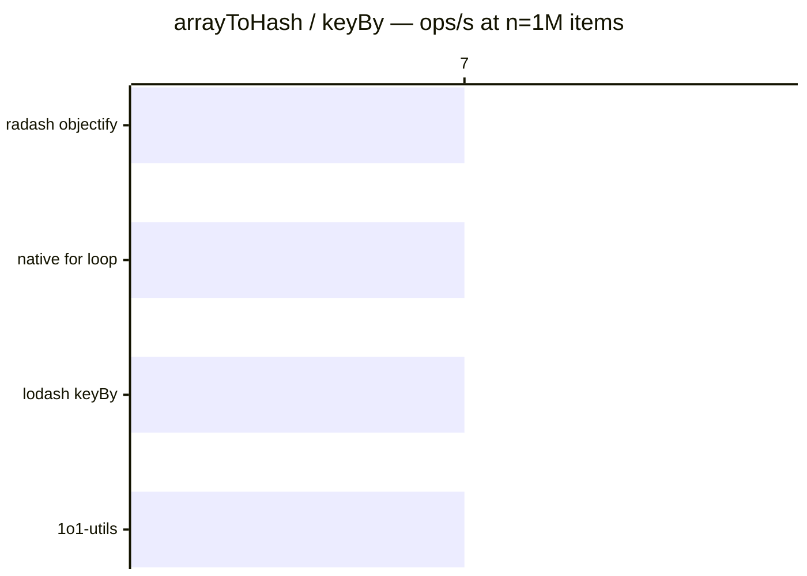

# arrayToHash / keyBy

[← Back to benchmarks](./README.md)

Converts an array into a hash/object keyed by a given property. Compared against `lodash.keyBy`, `radash.objectify`, and a native `for` loop.

---

| Size | 1o1-utils | lodash keyBy | radash objectify | native for loop | Fastest |
| ------ | ------ | ------ | ------ | ------ | ------ |
| n=100 | 4.2µs · 240.0K ops/s | 4.3µs · 230.7K ops/s | 4.1µs · 244.9K ops/s | 4.1µs · 244.9K ops/s | native for loop · 1.1× faster vs lodash |
| n=10k | 585.3µs · 1.7K ops/s | 593.7µs · 1.7K ops/s | 567.0µs · 1.8K ops/s | 579.5µs · 1.7K ops/s | radash objectify · on par vs lodash |
| n=100k | 10.16ms · 98 ops/s | 10.19ms · 98 ops/s | 9.44ms · 106 ops/s | 10.09ms · 99 ops/s | radash objectify · 1.1× faster vs lodash |
| n=1M | 149.6ms · 7 ops/s | 146.6ms · 7 ops/s | 134.9ms · 7 ops/s | 139.7ms · 7 ops/s | radash objectify · 1.1× faster vs lodash |

