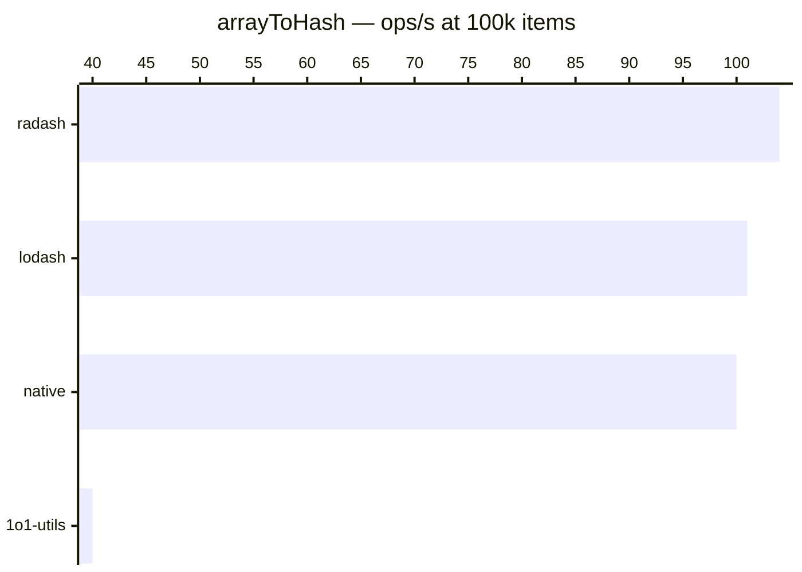

# arrayToHash / keyBy

[← Back to benchmarks](./README.md)

Converts an array into a hash/object keyed by a given property. Compared against `lodash.keyBy`, `radash.objectify`, and a native `for` loop with direct assignment.

> ⚠ **Performance warning**: 1o1-utils is currently ~3× slower than alternatives. This is a known issue and candidate for optimization.

---

| Size | 1o1-utils | lodash | radash | native | Fastest |
|------|-----------|--------|--------|--------|---------|
| n=100 | 0.010ms · 100K ops/s | 0.003ms · 308K ops/s | 0.003ms · 333K ops/s | 0.003ms · 338K ops/s | native · 1.1× vs lodash |
| n=10k | 1.90ms · 527 ops/s | 0.779ms · 1.3K ops/s | 0.761ms · 1.3K ops/s | 0.754ms · 1.3K ops/s | native · 1.0× vs lodash |
| n=100k | 25.25ms · 40 ops/s | 9.93ms · 101 ops/s | 9.66ms · 104 ops/s | 10.03ms · 100 ops/s | radash · 1.0× vs lodash |
| n=1M | 515.82ms · 2 ops/s | 146.36ms · 7 ops/s | 140.95ms · 7 ops/s | 141.63ms · 7 ops/s | radash · 1.0× vs lodash |



### Why is 1o1-utils slower?

The current implementation uses `Map` + `Object.fromEntries()`, which:

1. Creates a `Map` (extra allocation)
2. Iterates all entries to build the map
3. Calls `Object.fromEntries()` which iterates again to create the plain object

The competitors use direct object property assignment in a single pass — no intermediate data structure.

### Optimization path

Replace `Map` + `Object.fromEntries` with direct object assignment:

```ts
const result: Record<string, T> = {};
for (let i = 0; i < array.length; i++) {
  const k = array[i][key];
  if (k && typeof k === "string") {
    result[k] = array[i];
  }
}
return result;
```

This should bring performance in line with lodash/radash/native.
