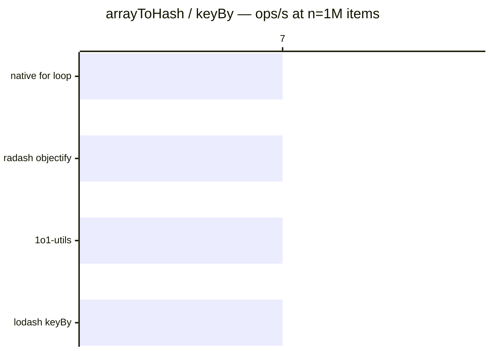

# arrayToHash / keyBy

[← Back to benchmarks](./README.md)

Converts an array into a hash/object keyed by a given property. Compared against `lodash.keyBy`, `radash.objectify`, and a native `for` loop.

---

| Size | 1o1-utils | lodash keyBy | radash objectify | native for loop | Fastest |
| ------ | ------ | ------ | ------ | ------ | ------ |
| n=100 | 4.0µs · 247.4K ops/s | 4.3µs · 233.0K ops/s | 3.9µs · 255.3K ops/s | 3.9µs · 255.3K ops/s | native for loop · 1.1× faster vs lodash |
| n=10k | 577.5µs · 1.7K ops/s | 589.7µs · 1.7K ops/s | 559.0µs · 1.8K ops/s | 565.9µs · 1.8K ops/s | radash objectify · 1.1× faster vs lodash |
| n=100k | 9.83ms · 102 ops/s | 9.17ms · 109 ops/s | 8.90ms · 112 ops/s | 8.88ms · 113 ops/s | native for loop · on par vs lodash |
| n=1M | 141.6ms · 7 ops/s | 146.4ms · 7 ops/s | 138.1ms · 7 ops/s | 138.0ms · 7 ops/s | native for loop · 1.1× faster vs lodash |

