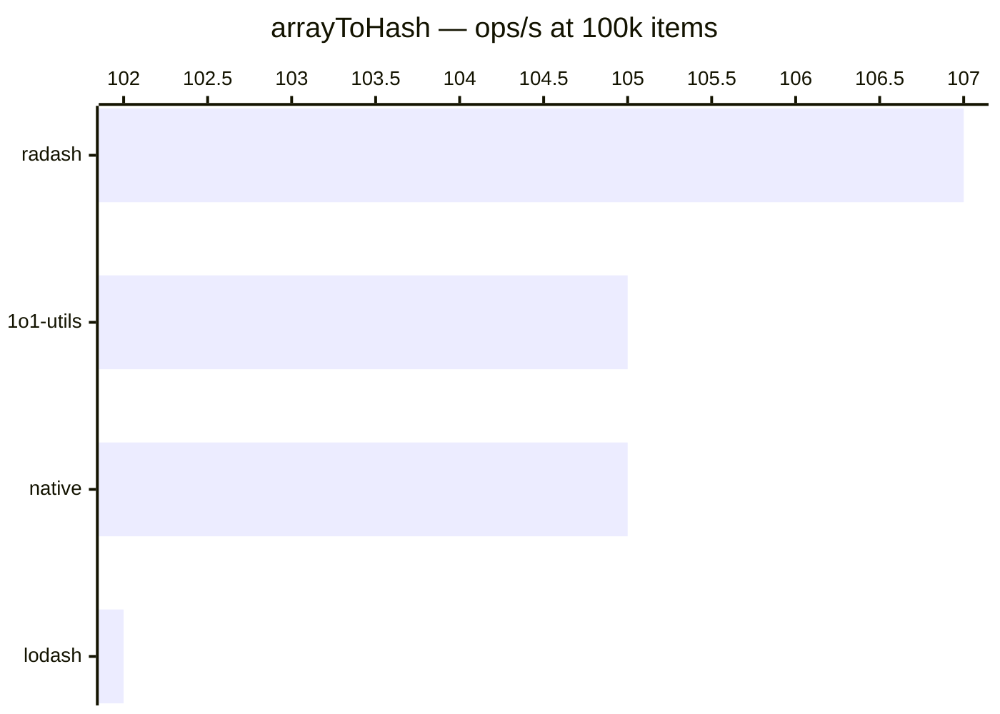

# arrayToHash / keyBy

[← Back to benchmarks](./README.md)

Converts an array into a hash/object keyed by a given property. Compared against `lodash.keyBy`, `radash.objectify`, and a native `for` loop with direct assignment.

---

| Size | 1o1-utils | lodash | radash | native | Fastest |
|------|-----------|--------|--------|--------|---------|
| n=100 | 0.004ms · 238K ops/s | 0.004ms · 226K ops/s | 0.004ms · 245K ops/s | 0.004ms · 245K ops/s | radash · 1.1× vs lodash |
| n=10k | 0.590ms · 1.7K ops/s | 0.607ms · 1.6K ops/s | 0.571ms · 1.8K ops/s | 0.577ms · 1.7K ops/s | radash · 1.1× vs lodash |
| n=100k | 9.57ms · 105 ops/s | 9.84ms · 102 ops/s | 9.34ms · 107 ops/s | 9.49ms · 105 ops/s | radash · 1.0× vs lodash |
| n=1M | 149.48ms · 7 ops/s | 150.47ms · 7 ops/s | 146.32ms · 7 ops/s | 147.13ms · 7 ops/s | radash · 1.0× vs lodash |

### Notes

All implementations are within margin of error — performance is essentially identical. The operation is bottlenecked by object property assignment at scale, not by implementation differences.
