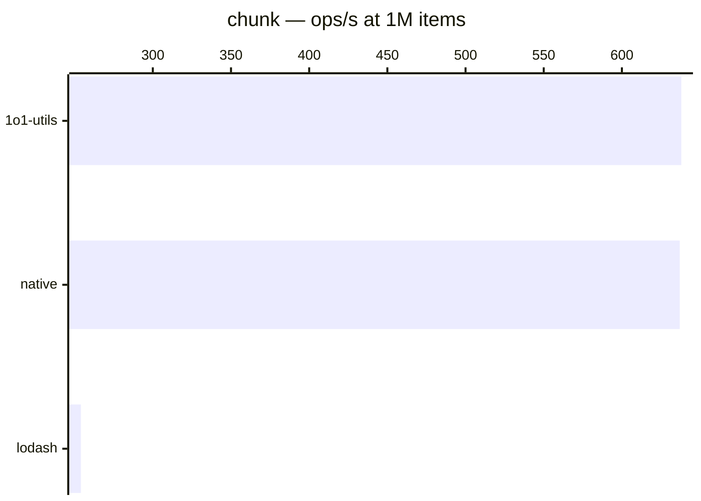

# chunk

[← Back to benchmarks](./README.md)

Splits an array into groups of the given size. Compared against `lodash.chunk` and a native `for + slice` loop.

---

| Size | 1o1-utils | lodash | native | Fastest |
|------|-----------|--------|--------|---------|
| n=100 | 0.000ms · 4.8M ops/s | 0.000ms · 3.4M ops/s | 0.000ms · 4.0M ops/s | 1o1-utils · 1.4× vs lodash |
| n=10k | 0.004ms · 270K ops/s | 0.021ms · 47K ops/s | 0.004ms · 250K ops/s | 1o1-utils · 5.7× vs lodash |
| n=100k | 0.018ms · 57K ops/s | 0.183ms · 5.5K ops/s | 0.018ms · 56K ops/s | 1o1-utils · 10.4× vs lodash |
| n=1M | 1.57ms · 638 ops/s | 3.93ms · 254 ops/s | 1.57ms · 637 ops/s | 1o1-utils · 2.5× vs lodash |
| n=10M | 9.16ms · 109 ops/s | 32.76ms · 31 ops/s | 9.17ms · 109 ops/s | 1o1-utils · 3.5× vs lodash |

### Why is 1o1-utils faster?

Pre-allocates the result array with `new Array(length)` instead of pushing to a dynamic array. At scale, this avoids repeated array resizing.
