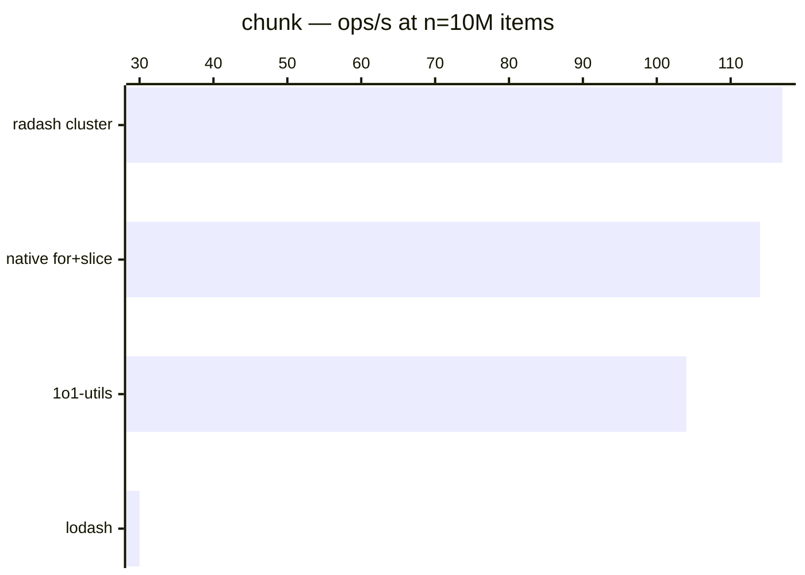

# chunk

[← Back to benchmarks](./README.md)

Splits an array into groups of the given size. Compared against `lodash.chunk` and a native `for + slice` loop.

---

| Size | 1o1-utils | lodash | radash cluster | native for+slice | Fastest |
| ------ | ------ | ------ | ------ | ------ | ------ |
| n=100 | 209ns · 4.8M ops/s | 292ns · 3.4M ops/s | 292ns · 3.4M ops/s | 250ns · 4.0M ops/s | 1o1-utils · 1.4× faster vs lodash |
| n=10k | 3.5µs · 289.2K ops/s | 21.0µs · 47.5K ops/s | 3.6µs · 279.1K ops/s | 3.8µs · 260.8K ops/s | 1o1-utils · 6.1× faster vs lodash |
| n=100k | 16.0µs · 62.3K ops/s | 183.1µs · 5.5K ops/s | 16.3µs · 61.5K ops/s | 16.2µs · 61.7K ops/s | 1o1-utils · 11.4× faster vs lodash |
| n=1M | 1.86ms · 537 ops/s | 3.88ms · 258 ops/s | 1.54ms · 649 ops/s | 1.53ms · 655 ops/s | native for+slice · 2.5× faster vs lodash |
| n=10M | 9.59ms · 104 ops/s | 33.18ms · 30 ops/s | 8.57ms · 117 ops/s | 8.79ms · 114 ops/s | radash cluster · 3.9× faster vs lodash |

