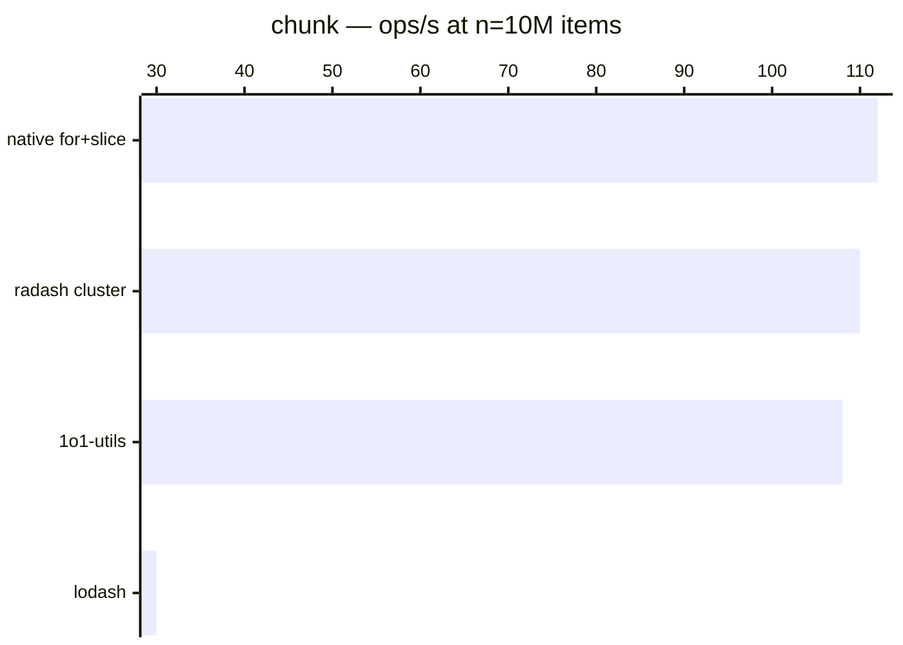

# chunk

[← Back to benchmarks](./README.md)

Splits an array into groups of the given size. Compared against `lodash.chunk` and a native `for + slice` loop.

---

| Size | 1o1-utils | lodash | radash cluster | native for+slice | Fastest |
| ------ | ------ | ------ | ------ | ------ | ------ |
| n=100 | 209ns · 4.8M ops/s | 292ns · 3.4M ops/s | 292ns · 3.4M ops/s | 250ns · 4.0M ops/s | 1o1-utils · 1.4× faster vs lodash |
| n=10k | 3.7µs · 266.7K ops/s | 21.1µs · 47.3K ops/s | 3.8µs · 263.7K ops/s | 4.0µs · 252.7K ops/s | 1o1-utils · 5.6× faster vs lodash |
| n=100k | 15.7µs · 63.8K ops/s | 183.4µs · 5.5K ops/s | 15.7µs · 63.5K ops/s | 15.7µs · 63.8K ops/s | native for+slice · 11.7× faster vs lodash |
| n=1M | 1.71ms · 584 ops/s | 3.88ms · 258 ops/s | 1.61ms · 619 ops/s | 1.63ms · 613 ops/s | radash cluster · 2.4× faster vs lodash |
| n=10M | 9.30ms · 108 ops/s | 33.15ms · 30 ops/s | 9.08ms · 110 ops/s | 8.93ms · 112 ops/s | native for+slice · 3.7× faster vs lodash |

