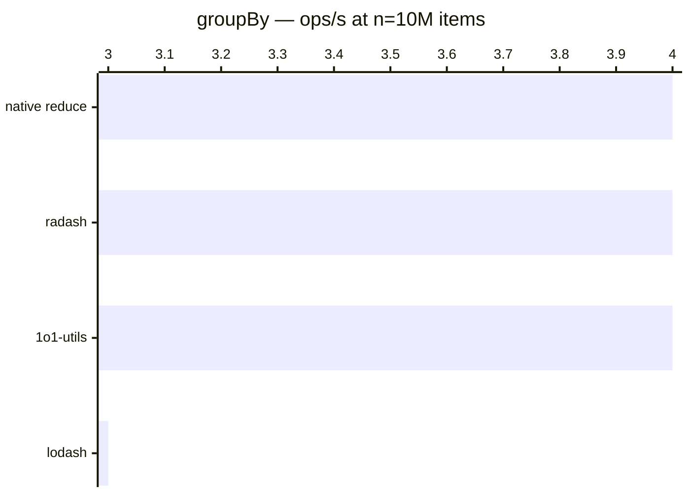

# groupBy

[← Back to benchmarks](./README.md)

Groups array items by a given key. Compared against `lodash.groupBy`, `radash.group`, and a native `reduce` approach.

---

| Size | 1o1-utils | lodash | radash | native reduce | Fastest |
| ------ | ------ | ------ | ------ | ------ | ------ |
| n=100 | 1.7µs · 585.1K ops/s | 2.3µs · 436.3K ops/s | 1.7µs · 600.2K ops/s | 1.5µs · 685.9K ops/s | native reduce · 1.6× faster vs lodash |
| n=10k | 175.0µs · 5.7K ops/s | 233.9µs · 4.3K ops/s | 168.1µs · 5.9K ops/s | 149.3µs · 6.7K ops/s | native reduce · 1.6× faster vs lodash |
| n=100k | 2.47ms · 405 ops/s | 3.06ms · 327 ops/s | 2.41ms · 414 ops/s | 2.11ms · 474 ops/s | native reduce · 1.4× faster vs lodash |
| n=1M | 23.50ms · 43 ops/s | 29.61ms · 34 ops/s | 22.80ms · 44 ops/s | 20.87ms · 48 ops/s | native reduce · 1.4× faster vs lodash |
| n=10M | 238.8ms · 4 ops/s | 318.3ms · 3 ops/s | 238.2ms · 4 ops/s | 230.7ms · 4 ops/s | native reduce · 1.4× faster vs lodash |

