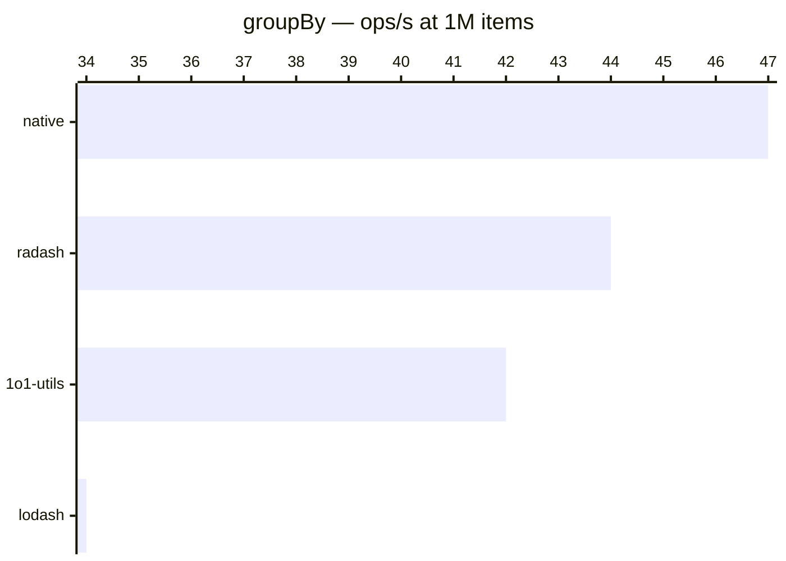

# groupBy

[← Back to benchmarks](./README.md)

Groups array items by a given key. Compared against `lodash.groupBy`, `radash.group`, and a native `reduce` approach.

---

| Size | 1o1-utils | lodash | radash | native | Fastest |
|------|-----------|--------|--------|--------|---------|
| n=100 | 0.002ms · 585K ops/s | 0.002ms · 436K ops/s | 0.002ms · 615K ops/s | 0.001ms · 706K ops/s | native · 1.6× vs lodash |
| n=10k | 0.177ms · 5.7K ops/s | 0.235ms · 4.3K ops/s | 0.167ms · 6.0K ops/s | 0.149ms · 6.7K ops/s | native · 1.6× vs lodash |
| n=100k | 2.55ms · 392 ops/s | 3.18ms · 315 ops/s | 2.43ms · 411 ops/s | 2.23ms · 448 ops/s | native · 1.4× vs lodash |
| n=1M | 23.78ms · 42 ops/s | 29.81ms · 34 ops/s | 22.65ms · 44 ops/s | 21.07ms · 47 ops/s | native · 1.4× vs lodash |
| n=10M | 230.20ms · 4 ops/s | 289.43ms · 3 ops/s | 221.31ms · 5 ops/s | 201.20ms · 5 ops/s | native · 1.7× vs lodash |

### Notes

- All implementations are close in performance. The difference between 1o1-utils and native is ~15%.
- 1o1-utils uses `String()` coercion on key values for safety, which adds slight overhead vs the native reduce that accesses the property directly.
- 1o1-utils is consistently **~1.3× faster** than lodash due to lower function call overhead.
