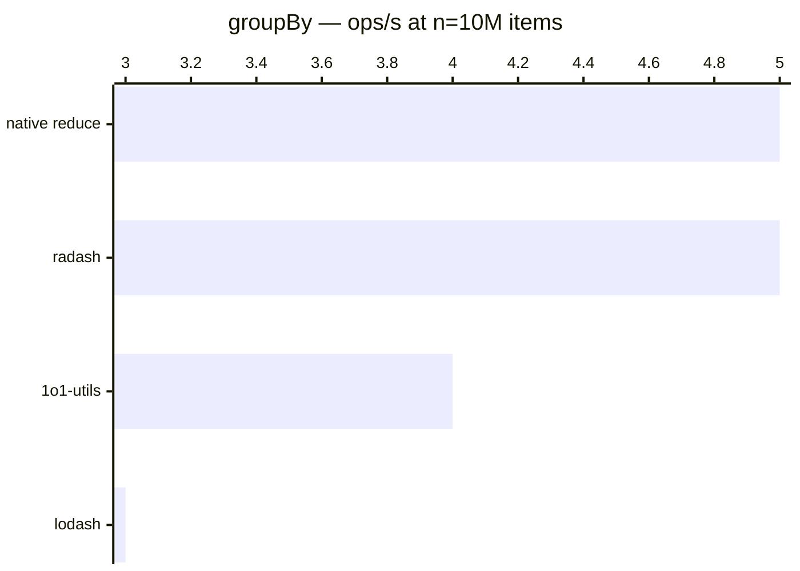

# groupBy

[← Back to benchmarks](./README.md)

Groups array items by a given key. Compared against `lodash.groupBy`, `radash.group`, and a native `reduce` approach.

---

| Size | 1o1-utils | lodash | radash | native reduce | Fastest |
| ------ | ------ | ------ | ------ | ------ | ------ |
| n=100 | 1.7µs · 585.1K ops/s | 2.3µs · 436.3K ops/s | 1.7µs · 600.2K ops/s | 1.5µs · 685.9K ops/s | native reduce · 1.6× faster vs lodash |
| n=10k | 176.5µs · 5.7K ops/s | 233.8µs · 4.3K ops/s | 168.6µs · 5.9K ops/s | 148.7µs · 6.7K ops/s | native reduce · 1.6× faster vs lodash |
| n=100k | 2.40ms · 416 ops/s | 3.04ms · 329 ops/s | 2.35ms · 426 ops/s | 2.18ms · 458 ops/s | native reduce · 1.4× faster vs lodash |
| n=1M | 23.97ms · 42 ops/s | 30.38ms · 33 ops/s | 22.87ms · 44 ops/s | 20.58ms · 49 ops/s | native reduce · 1.5× faster vs lodash |
| n=10M | 229.5ms · 4 ops/s | 290.3ms · 3 ops/s | 222.1ms · 5 ops/s | 204.9ms · 5 ops/s | native reduce · 1.4× faster vs lodash |

