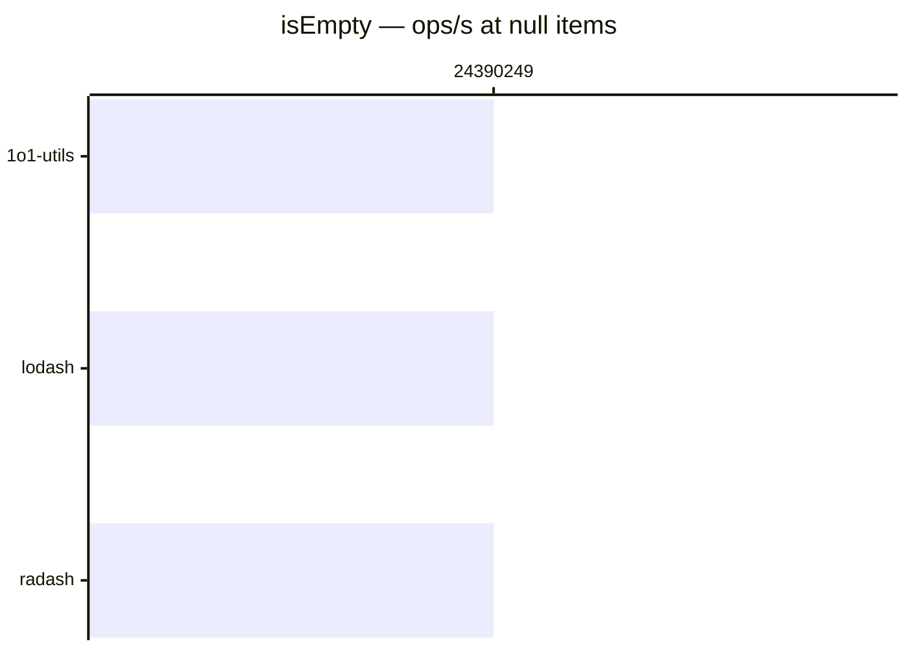

# isEmpty

[← Back to benchmarks](./README.md)

Checks if a value is empty (null, undefined, empty string, empty array, empty object, empty Map/Set). Compared against `lodash.isEmpty` and `radash.isEmpty`.

---

| Size | 1o1-utils | lodash | radash | Fastest |
| ------ | ------ | ------ | ------ | ------ |
| empty object | 41ns · 24.4M ops/s | 42ns · 23.8M ops/s | 83ns · 12.0M ops/s | 1o1-utils · on par vs lodash |
| filled object | 41ns · 24.4M ops/s | 41ns · 24.4M ops/s | 83ns · 12.0M ops/s | lodash · on par vs lodash |
| empty array | 41ns · 24.4M ops/s | 42ns · 23.8M ops/s | 83ns · 12.0M ops/s | 1o1-utils · on par vs lodash |
| filled array | 41ns · 24.4M ops/s | 42ns · 23.8M ops/s | 958ns · 1.0M ops/s | 1o1-utils · on par vs lodash |
| null | 41ns · 24.4M ops/s | 41ns · 24.4M ops/s | 41ns · 24.4M ops/s | radash · on par vs lodash |

