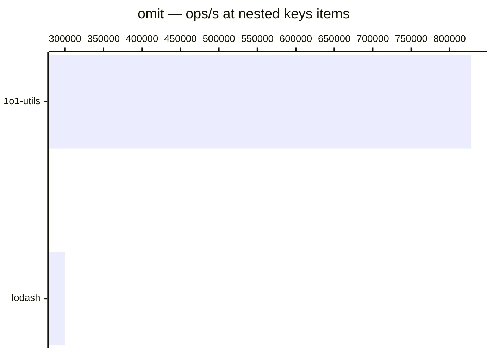

# omit

[← Back to benchmarks](./README.md)

Omits specified keys from an object, with support for nested dot notation. Compared against `lodash.omit` and `radash.omit`.

---

| Size | 1o1-utils | lodash | radash | Fastest |
| ------ | ------ | ------ | ------ | ------ |
| flat keys | 416ns · 2.4M ops/s | 875ns · 1.1M ops/s | 292ns · 3.4M ops/s | radash · 3.0× faster vs lodash |
| nested keys | 1.2µs · 827.8K ops/s | 3.3µs · 299.9K ops/s | — | 1o1-utils · 2.8× faster vs lodash |

