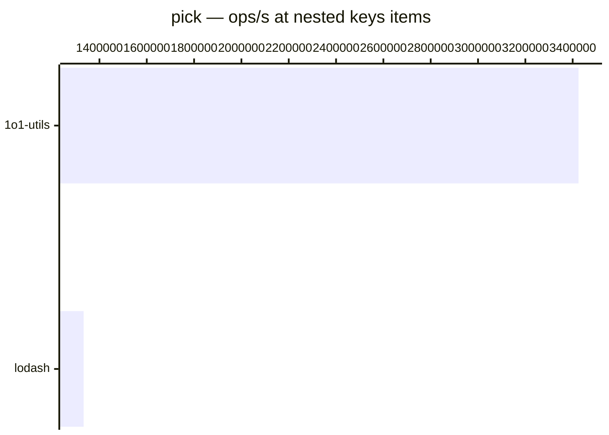

# pick

[← Back to benchmarks](./README.md)

Picks specified keys from an object, with support for nested dot notation. Compared against `lodash.pick`, `radash.pick`, and native destructuring.

---

| Size | 1o1-utils | lodash | radash | Fastest |
| ------ | ------ | ------ | ------ | ------ |
| flat keys | 125ns · 8.0M ops/s | 500ns · 2.0M ops/s | 125ns · 8.0M ops/s | radash · 4.0× faster vs lodash |
| nested keys | 292ns · 3.4M ops/s | 750ns · 1.3M ops/s | — | 1o1-utils · 2.6× faster vs lodash |

