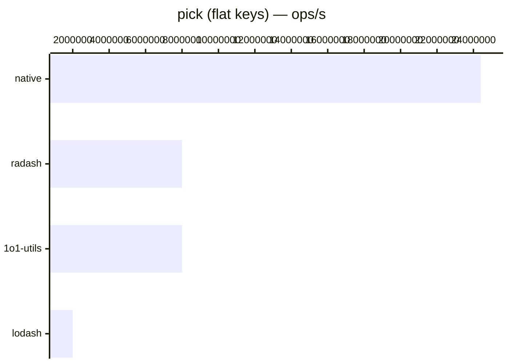

# pick

[← Back to benchmarks](./README.md)

Picks specified keys from an object, with support for nested dot notation. Compared against `lodash.pick`, `radash.pick`, and native destructuring.

---

| Variant | 1o1-utils | lodash | radash | native | Fastest |
|---------|-----------|--------|--------|--------|---------|
| flat keys | 0.000125ms · 8.0M ops/s | 0.000500ms · 2.0M ops/s | 0.000125ms · 8.0M ops/s | 0.000041ms · 24.4M ops/s | native · 4.0× vs lodash |
| nested keys | 0.000292ms · 3.4M ops/s | 0.000750ms · 1.3M ops/s | — | — | 1o1-utils · 2.6× vs lodash |

### Notes

- **Radash** does not support nested dot notation (`address.city`), so it's excluded from the nested keys benchmark.
- **Native destructuring** is the fastest for flat keys but requires knowing keys at compile time — not dynamic.
- 1o1-utils and radash are neck-and-neck on flat keys, both **4× faster** than lodash.
