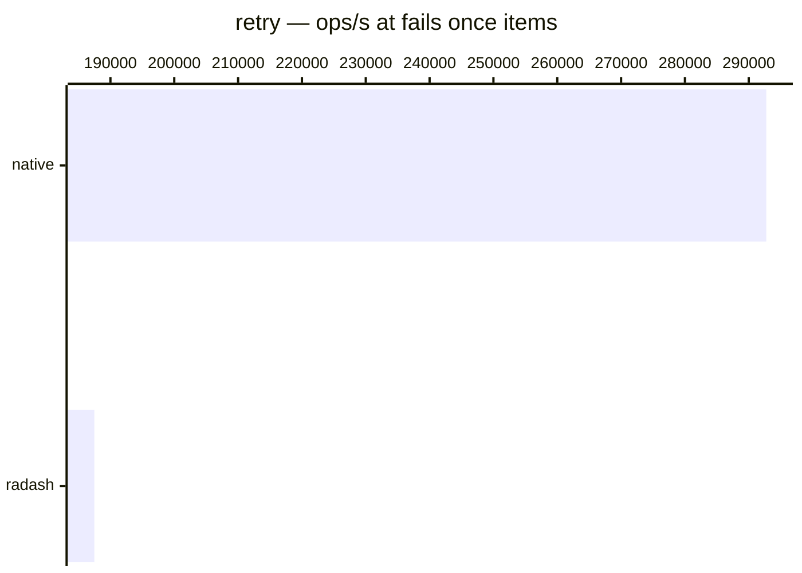

# retry

[← Back to benchmarks](./README.md)

Retries an async function with configurable attempts, delay, and backoff strategy. Compared against `radash.retry` and a native retry loop.

---

| Size | 1o1-utils | radash | native | Fastest |
| ------ | ------ | ------ | ------ | ------ |
| succeeds immediately | 167ns · 6.0M ops/s | 250ns · 4.0M ops/s | 125ns · 8.0M ops/s | native |
| fails once, fixed | 4.7µs · 212.4K ops/s | — | — | 1o1-utils |
| fails once | — | 5.3µs · 187.5K ops/s | 3.4µs · 292.7K ops/s | native |

