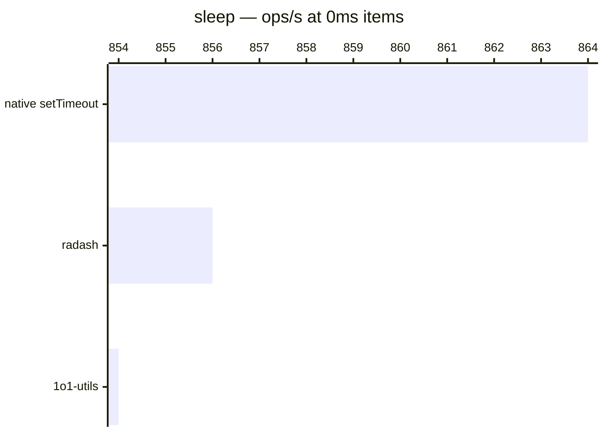

# sleep

[← Back to benchmarks](./README.md)

Async delay function. Compared against `radash.sleep` and native `setTimeout`.

---

| Size | 1o1-utils | radash | native setTimeout | Fastest |
| ------ | ------ | ------ | ------ | ------ |
| 0ms | 1.17ms · 854 ops/s | 1.17ms · 856 ops/s | 1.16ms · 864 ops/s | native setTimeout |

