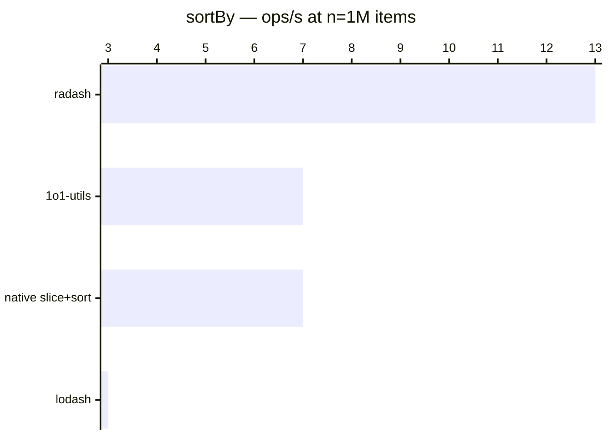

# sortBy

[← Back to benchmarks](./README.md)

---

| Size | 1o1-utils | lodash | radash | native slice+sort | Fastest |
| ------ | ------ | ------ | ------ | ------ | ------ |
| n=100 | 8.3µs · 120.0K ops/s | 14.7µs · 67.8K ops/s | 6.4µs · 155.8K ops/s | 8.1µs · 123.7K ops/s | radash · 2.3× faster vs lodash |
| n=10k | 1.10ms · 911 ops/s | 1.84ms · 544 ops/s | 648.2µs · 1.5K ops/s | 1.06ms · 941 ops/s | radash · 2.8× faster vs lodash |
| n=100k | 14.60ms · 69 ops/s | 25.26ms · 40 ops/s | 7.62ms · 131 ops/s | 14.17ms · 71 ops/s | radash · 3.3× faster vs lodash |
| n=1M | 145.5ms · 7 ops/s | 340.4ms · 3 ops/s | 74.72ms · 13 ops/s | 145.9ms · 7 ops/s | radash · 4.6× faster vs lodash |
| n=10M | 1585.1ms · 1 ops/s | 6993.8ms · 0 ops/s | 944.4ms · 1 ops/s | 1595.4ms · 1 ops/s | radash · 7.4× faster vs lodash |

