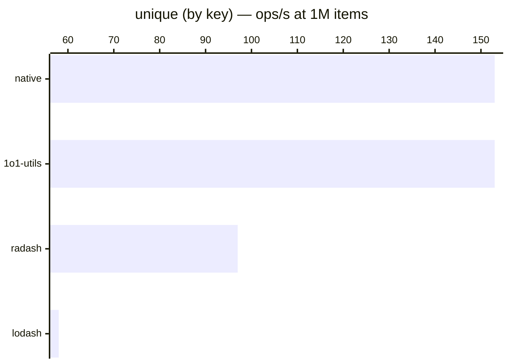

# unique (by key)

[← Back to benchmarks](./README.md)

Removes duplicate items from an array by a given key. Compared against `lodash.uniqBy`, `radash.unique`, and a native `Set + filter` approach.

---

| Size | 1o1-utils | lodash | radash | native | Fastest |
|------|-----------|--------|--------|--------|---------|
| n=100 | 0.001ms · 1.5M ops/s | 0.002ms · 545K ops/s | 0.001ms · 889K ops/s | 0.001ms · 1.5M ops/s | 1o1-utils · 2.8× vs lodash |
| n=10k | 0.061ms · 16.3K ops/s | 0.166ms · 6.0K ops/s | 0.096ms · 10.4K ops/s | 0.061ms · 16.4K ops/s | native · 2.7× vs lodash |
| n=100k | 0.661ms · 1.5K ops/s | 1.753ms · 571 ops/s | 1.028ms · 973 ops/s | 0.674ms · 1.5K ops/s | 1o1-utils · 2.6× vs lodash |
| n=1M | 6.55ms · 153 ops/s | 17.14ms · 58 ops/s | 10.27ms · 97 ops/s | 6.53ms · 153 ops/s | native · 2.6× vs lodash |
| n=10M | 65.30ms · 15 ops/s | 171.57ms · 6 ops/s | 101.28ms · 10 ops/s | 64.82ms · 15 ops/s | native · 2.5× vs lodash |

### Why is 1o1-utils fast?

Uses an indexed `for` loop with a `Set` for tracking seen values — the same strategy as the native approach. Lodash uses iteratee resolution overhead. Radash uses `filter` + `Array.findIndex` which is O(n) per check.
