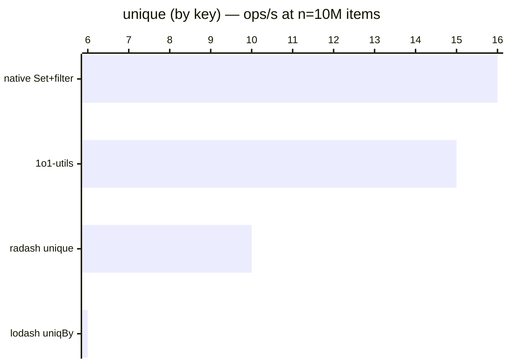

# unique (by key)

[← Back to benchmarks](./README.md)

Removes duplicate items from an array by a given key. Compared against `lodash.uniqBy`, `radash.unique`, and a native `Set + filter` approach.

---

| Size | 1o1-utils | lodash uniqBy | radash unique | native Set+filter | Fastest |
| ------ | ------ | ------ | ------ | ------ | ------ |
| n=100 | 708ns · 1.4M ops/s | 1.8µs · 545.6K ops/s | 1.1µs · 888.9K ops/s | 667ns · 1.5M ops/s | native Set+filter · 2.7× faster vs lodash |
| n=10k | 61.5µs · 16.3K ops/s | 165.2µs · 6.1K ops/s | 98.0µs · 10.2K ops/s | 60.5µs · 16.5K ops/s | native Set+filter · 2.7× faster vs lodash |
| n=100k | 648.5µs · 1.5K ops/s | 1.71ms · 586 ops/s | 1.02ms · 984 ops/s | 661.2µs · 1.5K ops/s | 1o1-utils · 2.6× faster vs lodash |
| n=1M | 6.49ms · 154 ops/s | 17.15ms · 58 ops/s | 10.06ms · 99 ops/s | 6.39ms · 156 ops/s | native Set+filter · 2.7× faster vs lodash |
| n=10M | 65.66ms · 15 ops/s | 171.4ms · 6 ops/s | 102.8ms · 10 ops/s | 63.40ms · 16 ops/s | native Set+filter · 2.7× faster vs lodash |

