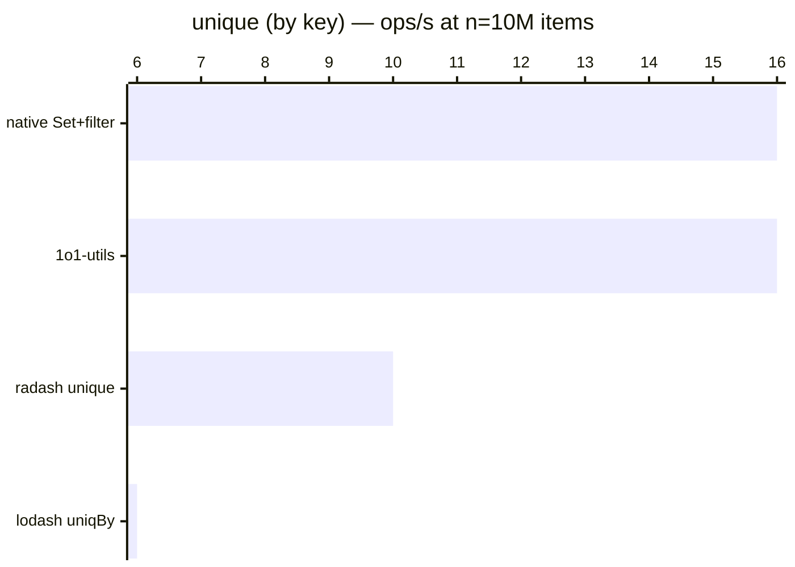

# unique (by key)

[← Back to benchmarks](./README.md)

Removes duplicate items from an array by a given key. Compared against `lodash.uniqBy`, `radash.unique`, and a native `Set + filter` approach.

---

| Size | 1o1-utils | lodash uniqBy | radash unique | native Set+filter | Fastest |
| ------ | ------ | ------ | ------ | ------ | ------ |
| n=100 | 667ns · 1.5M ops/s | 1.8µs · 545.6K ops/s | 1.1µs · 888.9K ops/s | 667ns · 1.5M ops/s | native Set+filter · 2.7× faster vs lodash |
| n=10k | 61.7µs · 16.2K ops/s | 166.9µs · 6.0K ops/s | 98.3µs · 10.2K ops/s | 60.9µs · 16.4K ops/s | native Set+filter · 2.7× faster vs lodash |
| n=100k | 675.3µs · 1.5K ops/s | 1.80ms · 555 ops/s | 1.04ms · 965 ops/s | 660.9µs · 1.5K ops/s | native Set+filter · 2.7× faster vs lodash |
| n=1M | 6.36ms · 157 ops/s | 17.05ms · 59 ops/s | 10.12ms · 99 ops/s | 6.28ms · 159 ops/s | native Set+filter · 2.7× faster vs lodash |
| n=10M | 63.51ms · 16 ops/s | 170.3ms · 6 ops/s | 100.8ms · 10 ops/s | 63.47ms · 16 ops/s | native Set+filter · 2.7× faster vs lodash |

