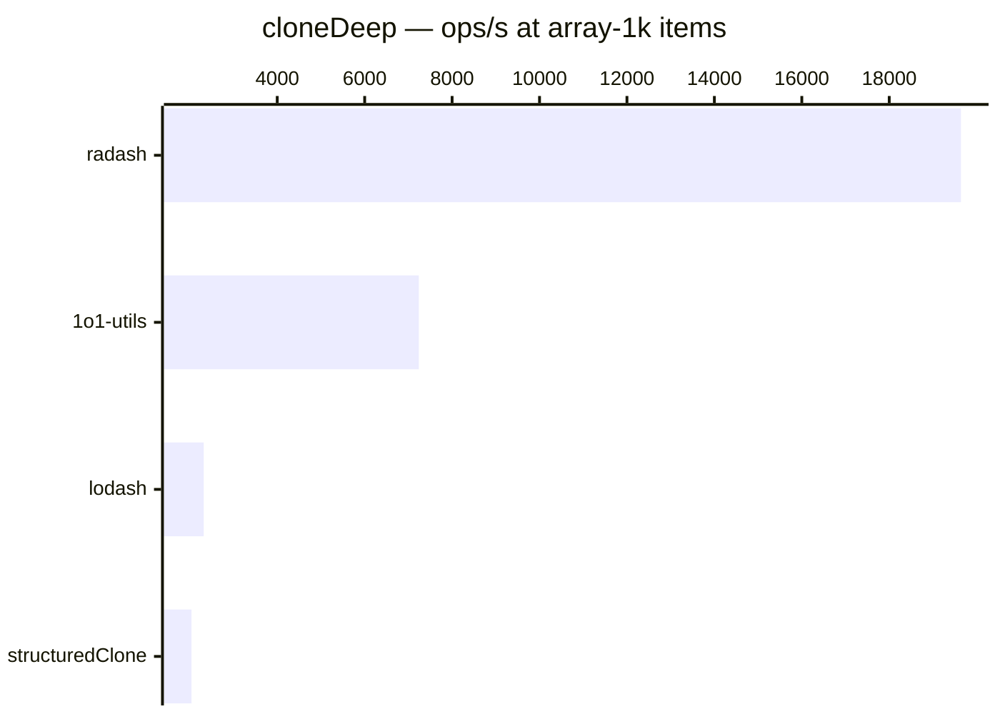

# cloneDeep

[← Back to benchmarks](./README.md)

Creates a deep clone of a value. Handles objects, arrays, dates, regexes, maps, sets, typed arrays, and circular references. Compared against `lodash.cloneDeep`, `radash.clone`, and native `structuredClone`.

> **Note:** `radash.clone` is **not a true deep clone** — nested objects, arrays, Maps, and Sets keep their original references. Its numbers are shown for reference only and are not comparable to the others.

---

| Size | 1o1-utils | lodash | radash | structuredClone | Fastest |
| ------ | ------ | ------ | ------ | ------ | ------ |
| small | 125ns · 8.0M ops/s | 375ns · 2.7M ops/s | 83ns · 12.0M ops/s | 833ns · 1.2M ops/s | radash · 4.5× faster vs lodash |
| deep | 875ns · 1.1M ops/s | 2.4µs · 421.1K ops/s | 42ns · 23.8M ops/s | 3.9µs · 255.3K ops/s | radash · 56.5× faster vs lodash |
| mixed | 1.5µs · 648.5K ops/s | 6.3µs · 159.0K ops/s | — | 4.0µs · 247.4K ops/s | 1o1-utils · 4.1× faster vs lodash |
| array-1k | 138.2µs · 7.2K ops/s | 431.4µs · 2.3K ops/s | 50.9µs · 19.6K ops/s | 490.5µs · 2.0K ops/s | radash · 8.5× faster vs lodash |

