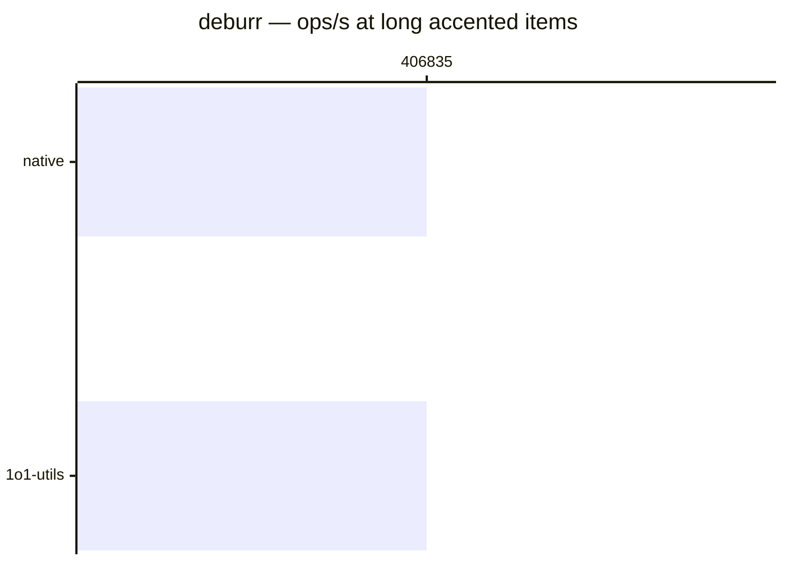

# deburr

[← Back to benchmarks](./README.md)

Strips diacritics (accents) from a string via Unicode NFD normalization. Compared against a native inline `normalize('NFD').replace(...)` baseline.

---

| Size | 1o1-utils | native | Fastest |
| ------ | ------ | ------ | ------ |
| ascii | 125ns · 8.0M ops/s | 125ns · 8.0M ops/s | native |
| short accented | 208ns · 4.8M ops/s | 208ns · 4.8M ops/s | native |
| long accented | 2.5µs · 406.8K ops/s | 2.5µs · 406.8K ops/s | native |

