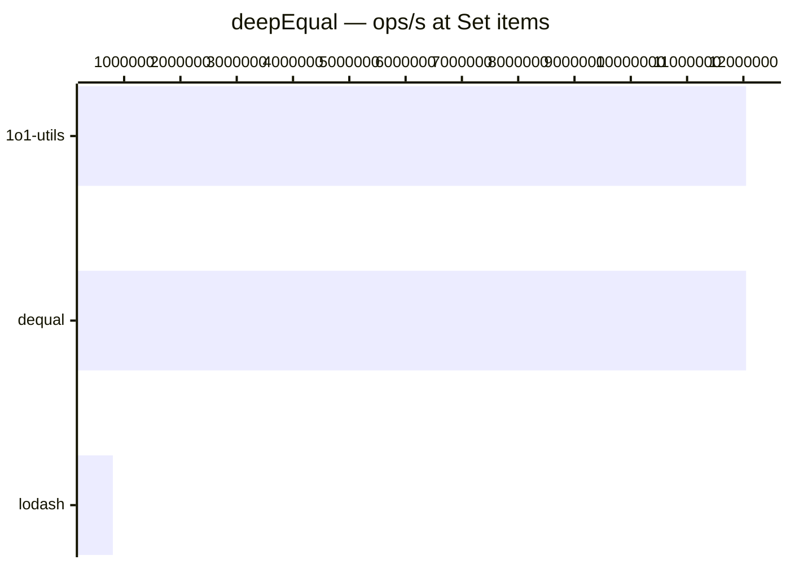

# deepEqual

[← Back to benchmarks](./README.md)

Deep structural equality check. Handles plain objects, arrays, dates, regexes, Maps, Sets, and typed arrays. Compared against `lodash.isEqual` and `dequal`.

---

| Size | 1o1-utils | lodash | dequal | Fastest |
| ------ | ------ | ------ | ------ | ------ |
| small nested object | 208ns · 4.8M ops/s | 833ns · 1.2M ops/s | 291ns · 3.4M ops/s | 1o1-utils · 4.0× faster vs lodash |
| deeply nested object | 1.3µs · 774.0K ops/s | 9.7µs · 103.0K ops/s | 2.0µs · 500.0K ops/s | 1o1-utils · 7.5× faster vs lodash |
| large array of objects | 7.1µs · 141.2K ops/s | 36.7µs · 27.2K ops/s | 10.3µs · 97.2K ops/s | 1o1-utils · 5.2× faster vs lodash |
| mismatch early | 125ns · 8.0M ops/s | 708ns · 1.4M ops/s | 208ns · 4.8M ops/s | 1o1-utils · 5.7× faster vs lodash |
| same ref | 41ns · 24.4M ops/s | 41ns · 24.4M ops/s | 41ns · 24.4M ops/s | lodash · on par vs lodash |
| Map | 125ns · 8.0M ops/s | 2.0µs · 490.0K ops/s | 125ns · 8.0M ops/s | dequal · 16.3× faster vs lodash |
| Set | 83ns · 12.0M ops/s | 1.3µs · 800.0K ops/s | 83ns · 12.0M ops/s | dequal · 15.1× faster vs lodash |

