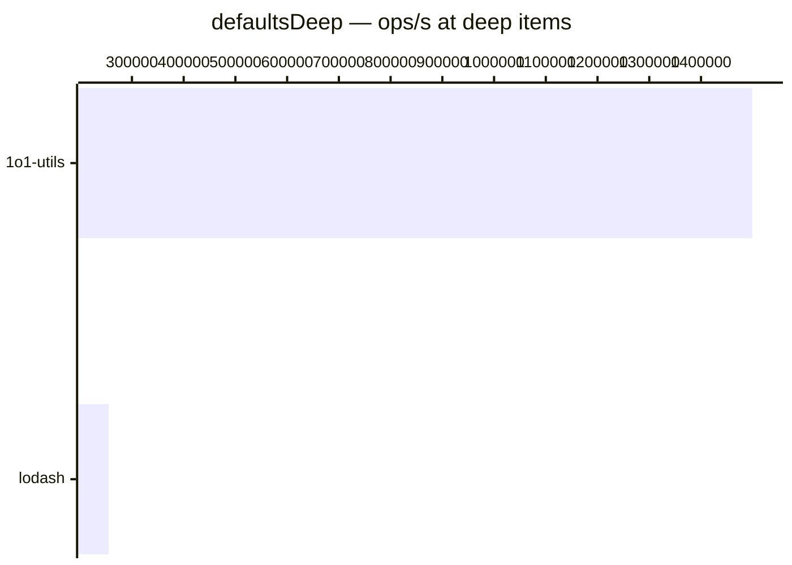

# defaultsDeep

[← Back to benchmarks](./README.md)

Recursively fills `undefined` properties in the target with values from the source. Arrays and non-plain-object values in the target are preserved. Compared against `lodash.defaultsDeep`.

---

| Size | 1o1-utils | lodash | Fastest |
| ------ | ------ | ------ | ------ |
| small | 125ns · 8.0M ops/s | 458ns · 2.2M ops/s | 1o1-utils · 3.7× faster vs lodash |
| deep | 667ns · 1.5M ops/s | 3.9µs · 255.3K ops/s | 1o1-utils · 5.9× faster vs lodash |

