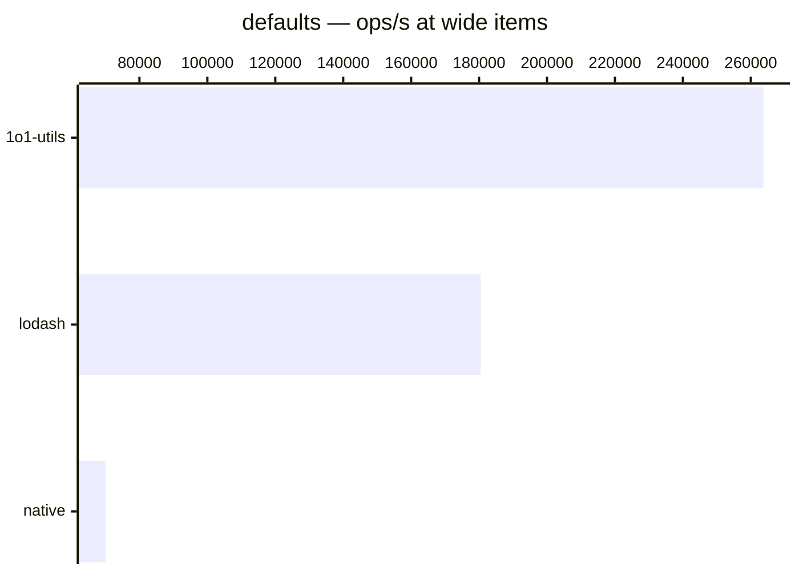

# defaults

[← Back to benchmarks](./README.md)

Fills `undefined` properties in the target with values from the source. Existing `null`, `0`, `""`, and `false` values are preserved. Compared against `lodash.defaults` and a native `Object.assign` spread.

---

| Size | 1o1-utils | lodash | native | Fastest |
| ------ | ------ | ------ | ------ | ------ |
| small | 167ns · 6.0M ops/s | 292ns · 3.4M ops/s | 84ns · 11.9M ops/s | native · 3.5× faster vs lodash |
| wide | 3.8µs · 263.7K ops/s | 5.5µs · 180.5K ops/s | 14.3µs · 70.0K ops/s | 1o1-utils · 1.5× faster vs lodash |

