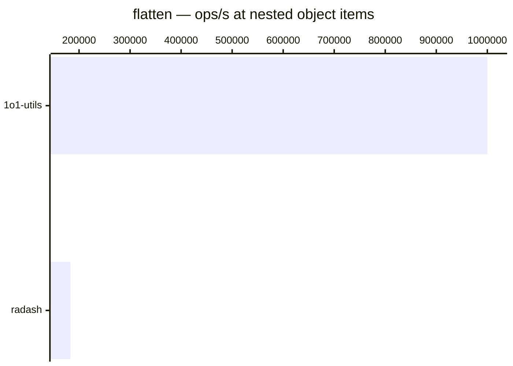

# flatten

[← Back to benchmarks](./README.md)

Deep-flattens an array (mirrors `Array.prototype.flat` with configurable depth) or converts a nested plain object into a flat record with dot-notation keys. Compared against `lodash.flattenDeep` and native `Array.prototype.flat` for arrays, and `radash.crush` for objects.

---

| Size | 1o1-utils | native | lodash | radash | Fastest |
| ------ | ------ | ------ | ------ | ------ | ------ |
| deep array | 250ns · 4.0M ops/s | 250ns · 4.0M ops/s | 250ns · 4.0M ops/s | — | lodash · on par vs lodash |
| nested object | 1.0µs · 1000.0K ops/s | — | — | 5.5µs · 183.2K ops/s | 1o1-utils |

