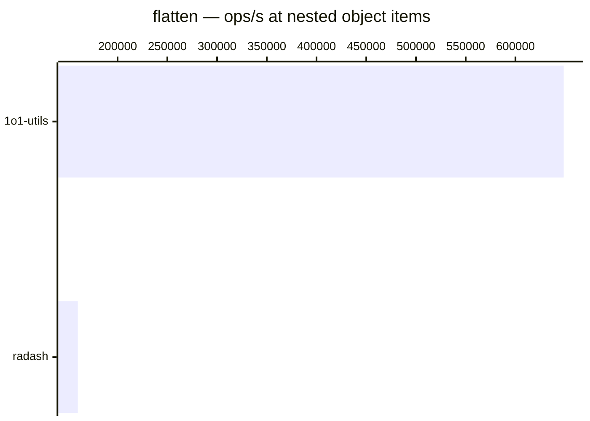

# flatten

[← Back to benchmarks](./README.md)

Deep-flattens an array (mirrors `Array.prototype.flat` with configurable depth) or converts a nested plain object into a flat record with dot-notation keys. Compared against `lodash.flattenDeep` and native `Array.prototype.flat` for arrays, and `radash.crush` for objects.

---

| Size | 1o1-utils | native | lodash | radash | Fastest |
| ------ | ------ | ------ | ------ | ------ | ------ |
| deep array | 292ns · 3.4M ops/s | 292ns · 3.4M ops/s | 291ns · 3.4M ops/s | — | lodash · on par vs lodash |
| nested object | 1.5µs · 648.5K ops/s | — | — | 6.3µs · 160.0K ops/s | 1o1-utils |

