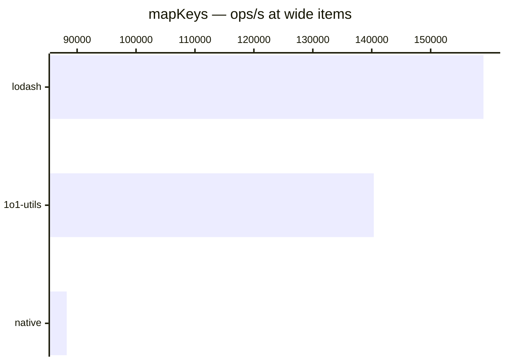

# mapKeys

[← Back to benchmarks](./README.md)

Transforms an object's keys via an iteratee function. Compared against `lodash.mapKeys` and a native `Object.fromEntries(Object.entries().map())` approach.

---

| Size | 1o1-utils | lodash | native | Fastest |
| ------ | ------ | ------ | ------ | ------ |
| small | 250ns · 4.0M ops/s | 250ns · 4.0M ops/s | 334ns · 3.0M ops/s | lodash · on par vs lodash |
| wide | 7.1µs · 140.4K ops/s | 6.3µs · 159.0K ops/s | 11.3µs · 88.2K ops/s | lodash · on par vs lodash |

