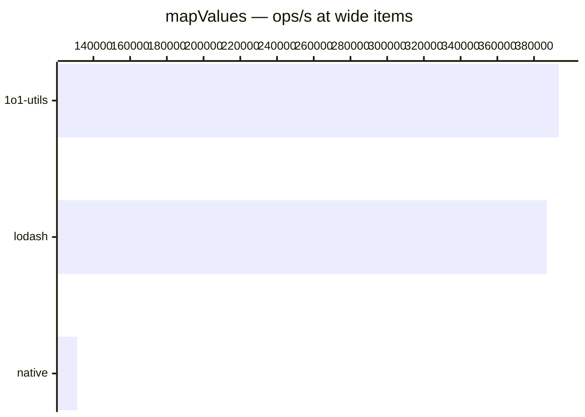

# mapValues

[← Back to benchmarks](./README.md)

Transforms an object's values via an iteratee function. Compared against `lodash.mapValues` and a native `Object.fromEntries(Object.entries().map())` approach.

---

| Size | 1o1-utils | lodash | native | Fastest |
| ------ | ------ | ------ | ------ | ------ |
| small | 83ns · 12.0M ops/s | 83ns · 12.0M ops/s | 208ns · 4.8M ops/s | lodash · on par vs lodash |
| wide | 2.5µs · 393.5K ops/s | 2.6µs · 387.0K ops/s | 7.6µs · 131.1K ops/s | 1o1-utils · on par vs lodash |

