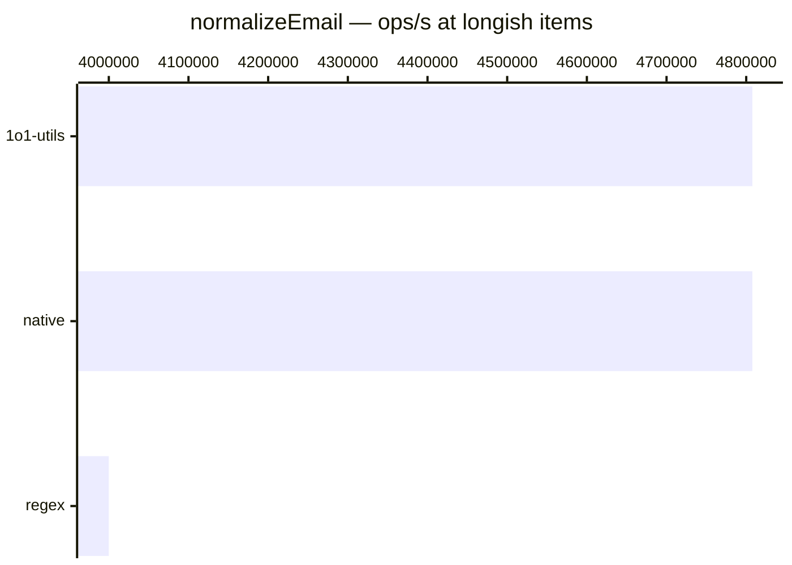

# normalizeEmail

[← Back to benchmarks](./README.md)

Normalizes an email: trim, lowercase, and optionally strip plus-addressing (`user+tag@x.com` → `user@x.com`). Compared against a native `trim().toLowerCase()` baseline and a regex-based plus-stripper.

---

| Size | 1o1-utils | native | regex | Fastest |
| ------ | ------ | ------ | ------ | ------ |
| plain | 41ns · 24.4M ops/s | 41ns · 24.4M ops/s | — | native |
| padded + plus | 125ns · 8.0M ops/s | 125ns · 8.0M ops/s | 125ns · 8.0M ops/s | regex |
| longish | 208ns · 4.8M ops/s | 208ns · 4.8M ops/s | 250ns · 4.0M ops/s | native |

