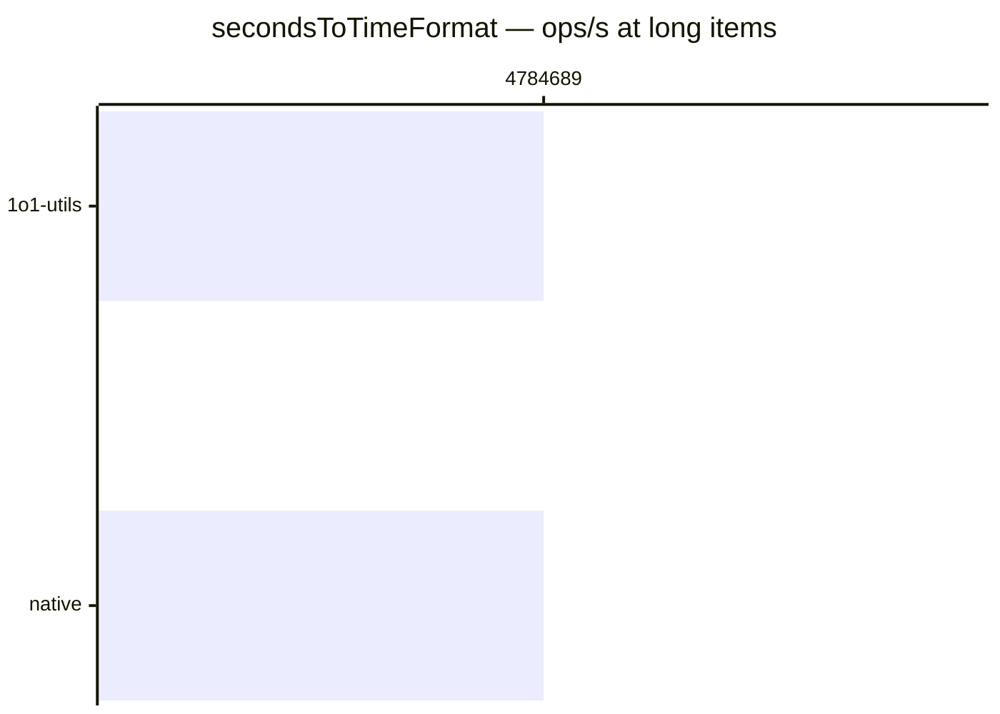

# secondsToTimeFormat

[← Back to benchmarks](./README.md)

Formats a number of seconds as a zero-padded `MM:SS` or `H:MM:SS` time string, with an optional `padHours` flag. Compared against a native inline implementation (no validation).

---

| Size | 1o1-utils | native | Fastest |
| ------ | ------ | ------ | ------ |
| small | 208ns · 4.8M ops/s | 208ns · 4.8M ops/s | native |
| minutes | 208ns · 4.8M ops/s | 208ns · 4.8M ops/s | native |
| hours | 209ns · 4.8M ops/s | 209ns · 4.8M ops/s | native |
| long | 209ns · 4.8M ops/s | 209ns · 4.8M ops/s | native |

