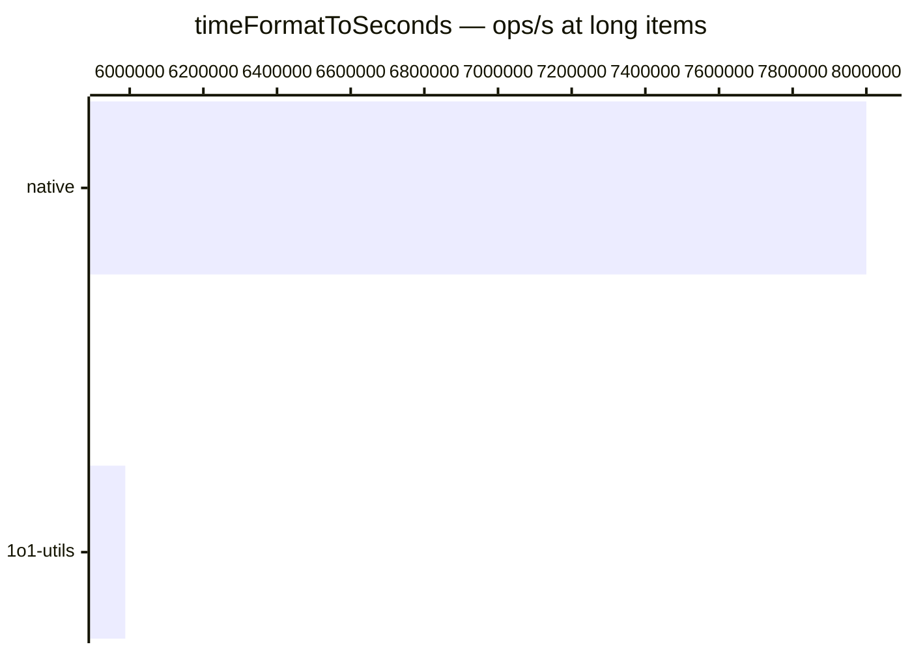

# timeFormatToSeconds

[← Back to benchmarks](./README.md)

Parses a `MM:SS` or `[H]H:MM:SS` time string into total seconds. Compared against a native inline `split` + `parseInt` baseline that skips validation and range checks.

---

| Size | 1o1-utils | native | Fastest |
| ------ | ------ | ------ | ------ |
| mm-ss | 125ns · 8.0M ops/s | 125ns · 8.0M ops/s | native |
| minutes | 166ns · 6.0M ops/s | 125ns · 8.0M ops/s | native |
| hours | 167ns · 6.0M ops/s | 166ns · 6.0M ops/s | native |
| long | 167ns · 6.0M ops/s | 125ns · 8.0M ops/s | native |

