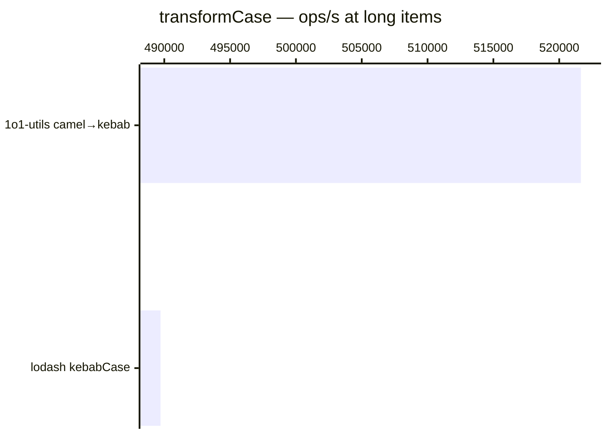

# transformCase

[← Back to benchmarks](./README.md)

Transforms strings between camelCase, kebab-case, snake_case, PascalCase, and Title Case, with optional acronym preservation. Compared against lodash case functions.

---

| Size | 1o1-utils camel→kebab | lodash kebabCase | 1o1-utils kebab→camel | lodash camelCase | 1o1-utils camel→snake | lodash snakeCase | 1o1-utils camel→title | lodash startCase | Fastest |
| ------ | ------ | ------ | ------ | ------ | ------ | ------ | ------ | ------ | ------ |
| short | 125ns · 8.0M ops/s | 250ns · 4.0M ops/s | 125ns · 8.0M ops/s | 292ns · 3.4M ops/s | 125ns · 8.0M ops/s | 250ns · 4.0M ops/s | 167ns · 6.0M ops/s | 333ns · 3.0M ops/s | 1o1-utils camel→snake · 2.0× faster vs lodash |
| medium | 250ns · 4.0M ops/s | 375ns · 2.7M ops/s | 375ns · 2.7M ops/s | 666ns · 1.5M ops/s | — | — | 458ns · 2.2M ops/s | 541ns · 1.8M ops/s | 1o1-utils camel→kebab · 1.5× faster vs lodash |
| long | 1.9µs · 521.6K ops/s | 2.0µs · 489.7K ops/s | — | — | — | — | — | — | 1o1-utils camel→kebab · 1.1× faster vs lodash |

