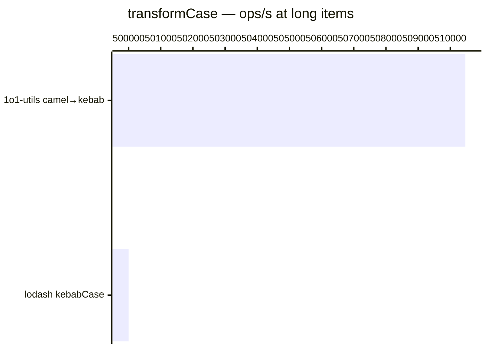

# transformCase

[← Back to benchmarks](./README.md)

Transforms strings between camelCase, kebab-case, snake_case, and PascalCase. Compared against lodash case functions.

---

| Size | 1o1-utils camel→kebab | lodash kebabCase | 1o1-utils kebab→camel | lodash camelCase | 1o1-utils camel→snake | lodash snakeCase | 1o1-utils camel→title | lodash startCase | Fastest |
| ------ | ------ | ------ | ------ | ------ | ------ | ------ | ------ | ------ | ------ |
| short | 125ns · 8.0M ops/s | 250ns · 4.0M ops/s | 166ns · 6.0M ops/s | 292ns · 3.4M ops/s | 125ns · 8.0M ops/s | 250ns · 4.0M ops/s | 208ns · 4.8M ops/s | 292ns · 3.4M ops/s | 1o1-utils camel→snake · 2.0× faster vs lodash |
| medium | 250ns · 4.0M ops/s | 334ns · 3.0M ops/s | 416ns · 2.4M ops/s | 625ns · 1.6M ops/s | — | — | 458ns · 2.2M ops/s | 541ns · 1.8M ops/s | 1o1-utils camel→kebab · 1.3× faster vs lodash |
| long | 2.0µs · 510.5K ops/s | 2.0µs · 500.0K ops/s | — | — | — | — | — | — | 1o1-utils camel→kebab · on par vs lodash |

