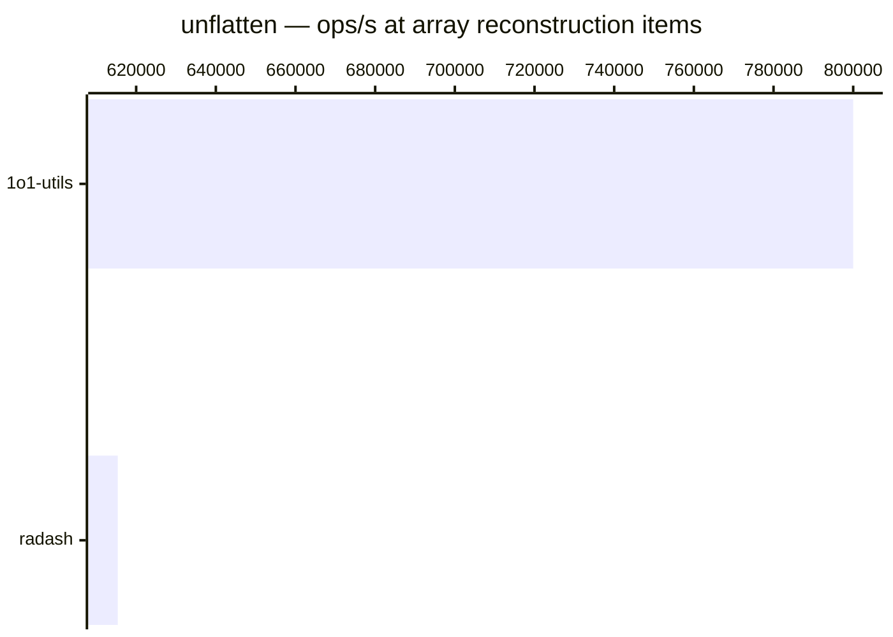

# unflatten

[← Back to benchmarks](./README.md)

Builds a nested object from a flat record of dot-notation keys — the inverse of `flatten` for objects. The optional `arrays` flag reconstructs arrays from all-numeric segments. Compared against `radash.construct`.

---

| Size | 1o1-utils | radash | Fastest |
| ------ | ------ | ------ | ------ |
| nested object | 2.9µs · 342.8K ops/s | 4.2µs · 237.6K ops/s | 1o1-utils |
| array reconstruction | 1.3µs · 800.0K ops/s | 1.6µs · 615.4K ops/s | 1o1-utils |

