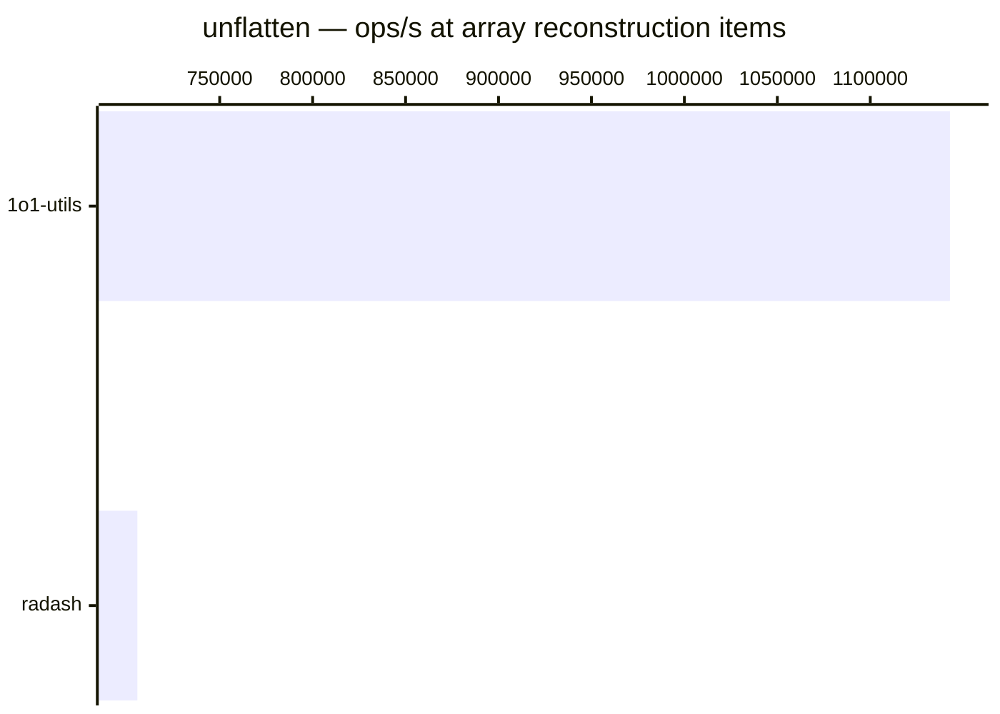

# unflatten

[← Back to benchmarks](./README.md)

Builds a nested object from a flat record of dot-notation keys — the inverse of `flatten` for objects. The optional `arrays` flag reconstructs arrays from all-numeric segments. Compared against `radash.construct`.

---

| Size | 1o1-utils | radash | Fastest |
| ------ | ------ | ------ | ------ |
| nested object | 1.9µs · 521.6K ops/s | 3.6µs · 275.9K ops/s | 1o1-utils |
| array reconstruction | 875ns · 1.1M ops/s | 1.4µs · 705.7K ops/s | 1o1-utils |

