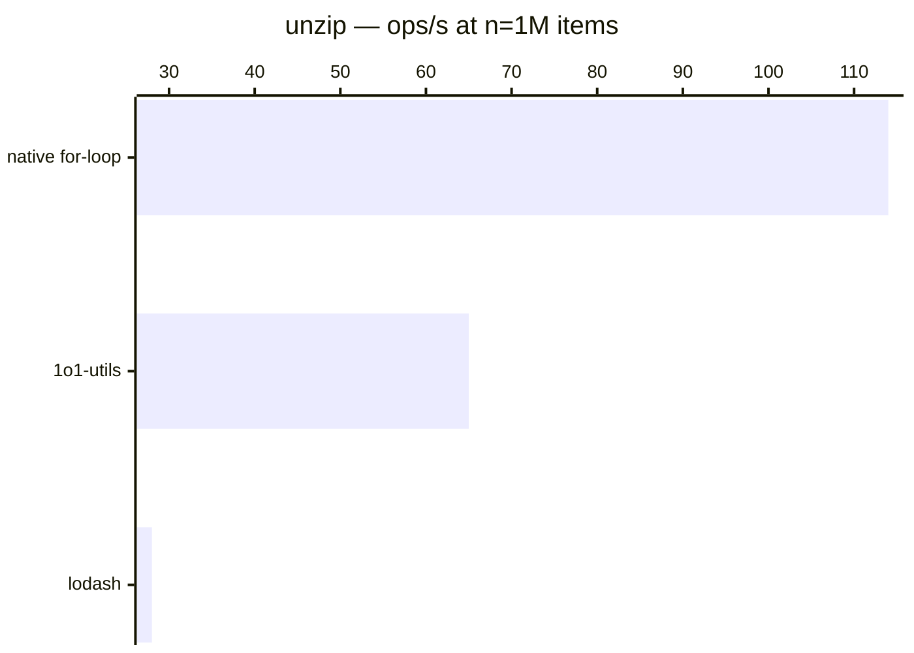

# unzip

[← Back to benchmarks](./README.md)

Splits an array of grouped tuples back into separate arrays — the inverse of `zip`. Compared against `lodash.unzip` and a native `for` loop hardcoded for the fixed shape.

---

| Size | 1o1-utils | lodash | native for-loop | Fastest |
| ------ | ------ | ------ | ------ | ------ |
| n=100 | 625ns · 1.6M ops/s | 2.3µs · 436.3K ops/s | 417ns · 2.4M ops/s | native for-loop · 5.5× faster vs lodash |
| n=10k | 61.7µs · 16.2K ops/s | 215.3µs · 4.6K ops/s | 40.1µs · 24.9K ops/s | native for-loop · 5.4× faster vs lodash |
| n=100k | 1.56ms · 639 ops/s | 4.15ms · 241 ops/s | 1.11ms · 901 ops/s | native for-loop · 3.7× faster vs lodash |
| n=1M | 15.30ms · 65 ops/s | 36.16ms · 28 ops/s | 8.77ms · 114 ops/s | native for-loop · 4.1× faster vs lodash |
| n=10M | 268.8ms · 4 ops/s | 668.3ms · 1 ops/s | 135.3ms · 7 ops/s | native for-loop · 4.9× faster vs lodash |

