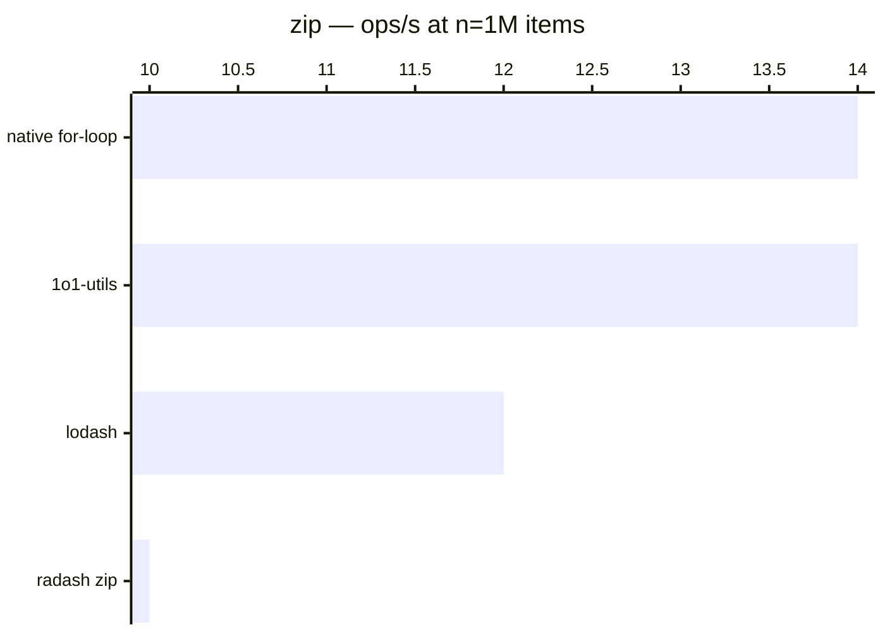

# zip

[← Back to benchmarks](./README.md)

Combines arrays by index into tuples, with `fill` (default) or `truncate` strategy for uneven lengths. Compared against `lodash.zip`, `radash.zip`, and a native `for` loop hardcoded for the fixed shape.

---

| Size | 1o1-utils | lodash | radash zip | native for-loop | Fastest |
| ------ | ------ | ------ | ------ | ------ | ------ |
| n=100 | 792ns · 1.3M ops/s | 1.4µs · 727.3K ops/s | 1.5µs · 685.4K ops/s | 333ns · 3.0M ops/s | native for-loop · 4.1× faster vs lodash |
| n=10k | 75.1µs · 13.3K ops/s | 132.0µs · 7.6K ops/s | 145.8µs · 6.9K ops/s | 36.1µs · 27.7K ops/s | native for-loop · 3.7× faster vs lodash |
| n=100k | 1.21ms · 826 ops/s | 2.28ms · 439 ops/s | 3.33ms · 301 ops/s | 1.54ms · 648 ops/s | 1o1-utils · 1.9× faster vs lodash |
| n=1M | 71.38ms · 14 ops/s | 86.05ms · 12 ops/s | 102.0ms · 10 ops/s | 70.32ms · 14 ops/s | native for-loop · 1.2× faster vs lodash |
| n=10M | 1305.6ms · 1 ops/s | 1728.5ms · 1 ops/s | 1895.3ms · 1 ops/s | 1615.6ms · 1 ops/s | 1o1-utils · 1.3× faster vs lodash |

